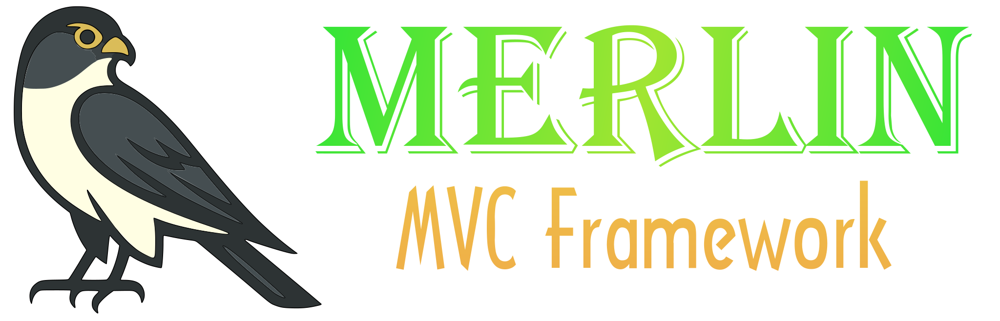

# Merlin MVC Framework



A lightweight, fast PHP framework for building modern MVC web applications and CLI tools. Merlin combines the best ideas from frameworks like Phalcon, CodeIgniter, and Laravel into a minimal yet powerful toolkit.

## Why Merlin?

**Lightweight & Fast** - Minimal dependencies and overhead. No bloat, just what you need.

**Modern PHP** - Built for PHP 8.0+, embracing type hints, named arguments, and modern patterns.

**Unified Query Builder** - One consistent, fluent API for all database operations, whether you're using models or raw queries.

**Flexible Architecture** - Use as much or as little as you need. Mix and match components freely.

**Secure by Default** - Prepared statements everywhere, CSRF protection, encryption helpers, and security best practices built in.

**Developer Friendly** - Intuitive APIs, clear error messages, and comprehensive documentation.

## Features

### MVC Stack

- **Router** - Fast pattern matching with named routes, parameter validation, and middleware support
- **Controllers** - Clean action-based controllers with dependency injection
- **Dispatcher** - Flexible request dispatching with middleware pipeline
- **ViewEngine** - Simple PHP-based templating with layout support

### Database & ORM

- **Query Builder** - Unified fluent interface for SELECT, INSERT, UPDATE, DELETE
- **Active Record Models** - Expressive model API with relationships and validation
- **Prepared Statements** - SQL injection protection by default
- **Read/Write Splitting** - Built-in support for master/replica database setups
- **Connection Pooling** - Automatic reconnection and connection management

### HTTP Utilities

- **Request** - Normalized access to GET, POST, headers, and file uploads
- **Response** - Fluent response building with JSON, redirects, and status codes
- **Session** - Secure session management with flash messages
- **Cookies** - Easy cookie handling with encryption support
- **Middleware** - Composable request/response filters

### CLI Tools

- **Console** - Task dispatcher for command-line operations
- **Tasks** - Structured CLI commands with parameter parsing
- **Perfect for** - Database migrations, cron jobs, data imports, maintenance scripts

### Additional Features

- **Security** - CSRF tokens, password hashing, encryption (Sodium/OpenSSL)
- **Logging** - Event-based logging hooks for database and application events
- **Pagination** - Built-in query pagination support
- **Exception Handling** - Structured exception hierarchy
- **AppContext** - Centralized service container for shared resources

## Requirements

- PHP >= 8.0
- PDO extension (`ext-pdo`)
- Multibyte String extension (`ext-mbstring`)
- Optional: Sodium or OpenSSL extension for advanced encryption features

## Installation

Install via Composer:

```bash
composer require simsaai/merlin
```

## Quick Start

### Web Application (MVC)

Create a simple web application with routing and controllers:

```php
<?php
require_once __DIR__ . '/vendor/autoload.php';

use Merlin\AppContext;
use Merlin\Db\Database;
use Merlin\Http\Response;
use Merlin\Mvc\Dispatcher;
use Merlin\Mvc\Router;

$ctx = AppContext::instance();
$ctx->db = new Database('mysql:host=localhost;dbname=app', 'user', 'pass');

$router = new Router();
$router->add('GET', '/hello/{name}', 'IndexController::helloAction');

$dispatcher = new Dispatcher($ctx);
$dispatcher->setBaseNamespace('App\\Controllers');

$route = $router->match('/hello/Merlin', 'GET');

if ($route === null) {
    Response::status(404)->send();
    return;
}

$response = $dispatcher->dispatch($route);
$response->send();
```

Controller example:

```php
<?php
namespace App\Controllers;

use Merlin\Mvc\Controller;

class IndexController extends Controller
{
    public function helloAction(string $name): string
    {
        return "Hello, {$name}!";
    }
}
```

### Working with Models

Define and use Active Record style models:

```php
class User extends \Merlin\Mvc\Model
{
    public int $id;
    public string $username;
    public string $email;
}

// Find by primary key
$user = User::find(1);

// Check existence
$exists = User::exists(['email' => 'john@example.com']);

// Query with conditions
$users = User::query()
    ->where('status', 'active')
    ->orderBy('created_at DESC')
    ->limit(10)
    ->select();

// Insert data
User::query()->insert([
    'username' => 'john',
    'email' => 'john@example.com',
]);

// Update records
User::query()
    ->where('id', 42)
    ->update(['status' => 'inactive']);

// Delete records
User::query()->where('status', 'spam')->delete();
```

### Advanced Query Builder

Build complex queries with joins, subqueries, and aggregations:

```php
use Merlin\Db\Query;

$results = Query::new()
    ->table('orders o')
    ->join('LEFT JOIN users u ON o.user_id = u.id')
    ->where('o.status', 'completed')
    ->where('o.total > ?', [100])
    ->groupBy('u.id')
    ->having('COUNT(*) > ?', [5])
    ->select(['u.username', 'COUNT(*) as order_count', 'SUM(o.total) as total_spent']);
```

### CLI Tasks

### CLI Tasks

Build command-line tools and scripts:

```php
<?php
require_once __DIR__ . '/vendor/autoload.php';

use Merlin\Cli\Console;

$task = $argv[1] ?? null;
$action = $argv[2] ?? null;
$params = array_slice($argv, 3);

$console = new Console();
$console->setNamespace('App\\Tasks');
$console->process($task, $action, $params);
```

Create a task:

```php
<?php
namespace App\Tasks;

use Merlin\Cli\Task;

class DatabaseTask extends Task
{
    public function migrateAction(string $direction = 'up'): void
    {
        echo "Running migration: {$direction}\n";
        // Your migration logic here
    }
}
```

Run tasks from the command line:

```bash
php console.php database migrate up
php console.php hello world John
```

## Project Structure

Recommended directory layout for Merlin applications:

```text
your-project/
├── app/
│   ├── Controllers/     # MVC controllers
│   ├── Models/          # Database models
│   ├── Tasks/           # CLI tasks
│   ├── Middleware/      # Custom middleware
│   └── views/           # View templates
├── public/
│   ├── index.php        # Web entry point
│   ├── css/
│   └── js/
├── config/
│   └── database.php     # Configuration files
├── console.php          # CLI entry point
├── composer.json
└── .gitignore
```

## Documentation

Comprehensive guides and references:

- **[Getting Started](docs/00-GETTING-STARTED.md)** - Set up your first Merlin project
- **[Architecture](docs/01-ARCHITECTURE.md)** - Understand core components and design principles
- **[MVC Routing](docs/02-MVC-ROUTING.md)** - Define routes, patterns, and middleware
- **[Controllers & Views](docs/03-CONTROLLERS-VIEWS.md)** - Build controllers and render views
- **[Models & ORM](docs/04-MODELS-ORM.md)** - Work with Active Record models
- **[Database Queries](docs/05-DATABASE-QUERIES.md)** - Master the query builder
- **[HTTP Request](docs/06-HTTP-REQUEST.md)** - Handle requests, uploads, and headers
- **[CLI Tasks](docs/07-CLI-TASKS.md)** - Create command-line tools
- **[Security](docs/08-SECURITY.md)** - Best practices and security features
- **[Logging](docs/09-LOGGING.md)** - Application and database logging
- **[Cookbook](docs/10-COOKBOOK.md)** - Practical recipes and examples
- **[API Reference](docs/11-API-REFERENCE.md)** - Complete API documentation

## Key Concepts

### AppContext - Service Container

Centralized access to shared services:

```php
use Merlin\AppContext;
use Merlin\Db\Database;

$ctx = AppContext::instance();
// Set up database connection
$ctx->db = new Database('mysql:host=localhost;dbname=app', 'user', 'pass');
// Access lazy-loaded service
$ctx->getView()->setPath(__DIR__ . '/app/views');

// Access anywhere
$db = AppContext::instance()->db;
```

### Middleware Pipeline

Add custom logic to the request/response cycle:

```php
$dispatcher = new Dispatcher($ctx);
$dispatcher->addMiddleware(new AuthMiddleware());
$dispatcher->addMiddleware(new SessionMiddleware());
$response = $dispatcher->dispatch($route);
```

### Read/Write Database Splitting

Separate read and write connections for scalability:

```php
$ctx->dbWrite = new Database('mysql:host=master;dbname=app', 'user', 'pass');
$ctx->dbRead = new Database('mysql:host=replica;dbname=app', 'user', 'pass');

// Writes go to master, reads go to replica automatically
```

## Development

### Running Tests

Merlin uses PHPUnit for testing:

```bash
# Run all tests
./vendor/bin/phpunit

# Run specific test file
./vendor/bin/phpunit tests/Db/QueryBuilderTest.php

# Run with coverage (requires Xdebug)
./vendor/bin/phpunit --coverage-html coverage/
```

### Code Quality

```bash
# Install dev dependencies
composer install --dev

# Run tests
composer test
```

## Contributing

Contributions are welcome! Please feel free to submit pull requests or open issues for bugs and feature requests.

When contributing:

1. Fork the repository
2. Create a feature branch (`git checkout -b feature/amazing-feature`)
3. Write tests for new functionality
4. Ensure all tests pass
5. Commit your changes (`git commit -m 'Add amazing feature'`)
6. Push to the branch (`git push origin feature/amazing-feature`)
7. Open a Pull Request

## Examples

Check out the `examples/` directory for complete working examples:

- **[AdvancedQueryBuilderExample.php](examples/AdvancedQueryBuilderExample.php)** - Complex queries with joins, subqueries, window functions, and aggregations. Perfect for learning sophisticated query patterns.
- **[CompositeKeyExamples.php](examples/CompositeKeyExamples.php)** - Working with models that have composite primary keys, such as many-to-many junction tables and multi-tenant databases.
- **[ModelLoadMethodsExample.php](examples/ModelLoadMethodsExample.php)** - Using convenience methods like `find()`, `findOne()`, `findAll()`, `exists()`, and `count()` for retrieving model data.
- **[ReadWriteConnectionExample.php](examples/ReadWriteConnectionExample.php)** - Setting up separate read and write database connections for master/replica configurations and improved scalability.
- **[SaveCreateUpdateExample.php](examples/SaveCreateUpdateExample.php)** - Complete CRUD operations including `create()`, `update()`, `save()`, `delete()`, and tracking changes with `hasChanged()`.
- **[SqlNodeExample.php](examples/SqlNodeExample.php)** - Advanced SQL expressions using the `Sql` class for raw SQL, functions, subqueries, and complex conditions within the query builder.

## Philosophy

Merlin is designed with these principles:

- **Simplicity over magic** - Explicit is better than implicit
- **Performance** - Minimal overhead and memory footprint
- **Standards** - PSR-compliant where applicable
- **Flexibility** - Use what you need, ignore the rest
- **Security** - Secure by default, not as an afterthought

## Acknowledgments

Merlin draws inspiration from:

- **Phalcon** - Speed and C-based architecture concepts
- **CodeIgniter** - Simplicity and developer-friendly APIs
- **Laravel** - Elegant syntax and query builder design

## About the Name

Merlins are small falcons known for their speed, agility, and hunting precision. These characteristics reflect the goals of the Merlin framework: a lightweight, fast, and focused MVC system. The name is also a deliberate reference to Phalcon, which strongly influenced Merlin’s design.

## License

MIT License - see [LICENSE](LICENSE) file for details.

---

**Made with 💖 and ⚡ by developers, for developers.**
