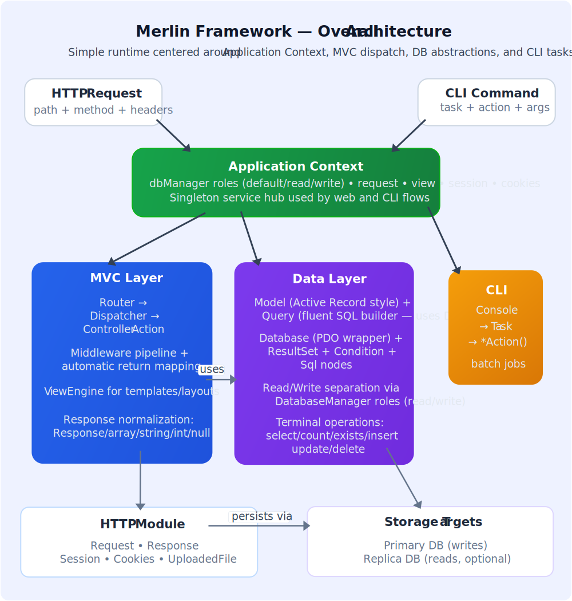

# Architecture

**Understanding Merlin's design** - Learn how Merlin's core components fit together, from the AppContext service container to the MVC layer, database abstraction, and CLI tools. This guide explains the framework's architectural principles and design decisions.

This document outlines how core Merlin components work together.



## Core Principles

- Lightweight runtime with minimal mandatory dependencies
- Explicit routing and dispatch
- Unified query API for model and table workflows
- Read/write DB separation support
- Simple composition through `AppContext`

## Main Components

Merlin is organized into distinct layers, each handling a specific concern. Understanding these components helps you leverage the framework effectively.

### `AppContext`

Central runtime context and service container – accessed as a singleton via `AppContext::instance()`.

Built-in lazy service accessors:

| Method        | Returns                                                |
| ------------- | ------------------------------------------------------ |
| `request()`   | `Merlin\Http\Request`                                  |
| `view()`      | `Merlin\Mvc\ViewEngine`                                |
| `session()`   | `Merlin\Http\Session\|null`                            |
| `cookies()`   | `Merlin\Http\Cookies`                                  |
| `dbManager()` | `Merlin\Db\DatabaseManager`                            |
| `route()`     | `Merlin\ResolvedRoute\|null` – populated by Dispatcher |

Custom services can be registered with `$ctx->set($id, $service)` and retrieved with `$ctx->get($id)`. Auto-wiring is supported: unregistered class names are instantiated via reflection with their constructor dependencies resolved recursively from the container.

### MVC Layer

- `Router` matches URI + method to route patterns, extracting parameters
- `Dispatcher` is instantiated without arguments; obtains `AppContext` internally. It resolves controllers via DI (`AppContext::get()`), executes the middleware pipeline, injects action parameters (route vars or DI), and stores route info via `AppContext::setRoute()`
- `Controller` provides access to request/context plus lifecycle hooks
- `ViewEngine` renders templates, layouts, and namespaced views
- `RoutingResult` (in `AppContext->route`) contains resolved route information accessible anywhere

### Data Layer

- `Model` provides Active Record style methods and state tracking
- `Query` is the fluent SQL builder for select/write/count/exists
- `Database` wraps PDO and transaction helpers
- `ResultSet` provides iterable model/row access

### CLI Layer

- `Console` maps CLI args to `Task` classes and `*Action()` methods
- `Task` is the base class for commands

## Request Flow (Web)

Understanding the request lifecycle helps you know where to hook in custom logic. Each request follows a clear path from router to controller to response.

```text
HTTP Request
  -> Router::match()
  -> Dispatcher::dispatch(routeInfo)
  -> Controller action
  -> Response
```

`Dispatcher` maps controller return types automatically:

- `Response` -> sent as-is
- `array` / `JsonSerializable` -> JSON response
- `string` -> text response
- `int` -> status response
- `null` -> `204`

## Data Flow

Merlin offers flexibility in how you interact with the database. Choose the approach that fits your needs - models for object-oriented work, or Query for direct table access.

Two common entry points:

```php
// Model-centric
$user = User::find(10);
$rows = User::query()->where('status', 'active')->select();

// Table-centric
$rows = Merlin\Db\Query::new()
    ->table('users')
    ->where('status', 'active')
    ->select();
```

Write operations are terminal builder calls (`insert`, `upsert`, `update`, `delete`).

## Read/Write Separation

Merlin supports replica setups through `DatabaseManager` roles.

Register named connections in bootstrap:

```php
$mgr = $ctx->dbManager();
$mgr->set('write', new Database('mysql:host=primary;dbname=app', 'rw', 'secret'));
$mgr->set('read',  fn() => new Database('mysql:host=replica;dbname=app', 'ro', 'secret'));
```

Models read from the `read` role and write to the `write` role by default, falling back to the registered default when the role is absent. Per-model overrides:

```php
User::setDefaultReadRole('replica');
User::setDefaultWriteRole('primary');
User::setDefaultRole('analytics'); // both read + write
```

For single-database apps, register one connection under any name – models fall through to the default automatically:

```php
$ctx->dbManager()->set('default', new Database(...));
```

## Extensibility Points

- Router custom parameter validators via `addType()`
- Router route groups via `prefix()` and `middleware()`
- Dispatcher middleware groups and controller factory
- Model overrides: `source()`, `schema()`, `idFields()`, connection methods
- Query SQL escape hatches via `Sql` nodes
